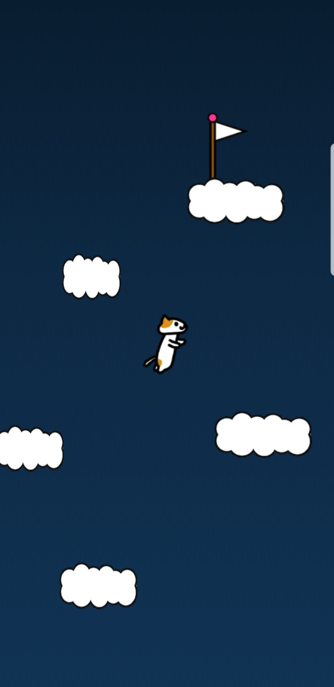

# Climb_Cloud_Game
 
## 기획

- 주제 : 구름을 밟고 올라가는 게임
- 내용 :
    - 스마트폰의 기울기에 따라 플레이어가 좌우로 이동함
    - 탭하면 점프
    - 구름에 올라가면 화면도 위로 옮겨짐
    - 깃발에 도착하면 게임 클리어
- 리소스 :
    1. 오브젝트 : 플레이어, 깃발, 구름, 배경 이미지, 클리어 이미지
    2. 컨트롤러 스크립트 : 플레이어 컨트롤러
    3. 제네레이터 스크립트 : x
    4. 감독 스크립트 : 씬 전환용 감독
    5. 흐름 : 컨트롤러 -> 감독

## 결과

- 버전 1  
    